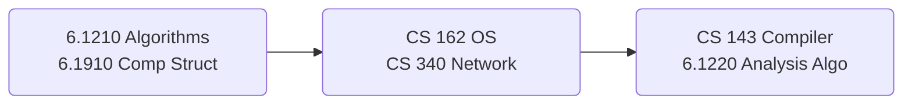

# Curriculum

---

## Subjects List

<aside>
🔥 공통과목

[MIT 6.1210 Introduction to Algorithms](https://www.notion.so/MIT-6-1210-Introduction-to-Algorithms-043a0f0f19bd431ca7466bfa767523a9?pvs=21)

[MIT 6.1910 Computation Structures](https://www.notion.so/MIT-6-1910-Computation-Structures-fc8ae1e78117407bab23b05e4222b1e7?pvs=21)

[Berkeley CS 162 Operating Systems and Systems Programming](https://www.notion.so/Berkeley-CS-162-Operating-Systems-and-Systems-Programming-3417a770407c458aa5ea2d7572395581?pvs=21)

[Northwestern CS 340 Introduction to Networking](https://www.notion.so/Northwestern-CS-340-Introduction-to-Networking-501691c60cac4b8c8160fe573a32fdb5?pvs=21)

[Stanford CS 143 Compilers](https://www.notion.so/Stanford-CS-143-Compilers-310516a3865c491fb6be0836a60beeaf?pvs=21)

[MIT 6.1220 Design and Analysis of Algorithms](https://www.notion.so/MIT-6-1220-Design-and-Analysis-of-Algorithms-ae5b23325102463e99b7fe74d04c42e2?pvs=21)

</aside>

<aside>
📖 개인과목

</aside>

## Outline

